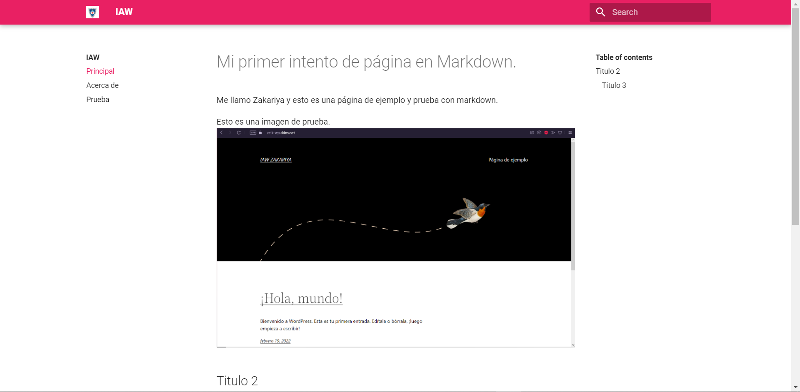

# Práctica: Creación de un sitio web estático con MkDocs y GitHub Pages
---
Sitio: https://legofzhak.github.io/practica-iaw-mkdocks/lego



MkDocs es un generador de sitios web estáticos que nos permite crear de forma sencilla un sitio web para documentar un proyecto. El contenido del sitio web está escrito en texto plano en formato Markdown y se configura con un único archivo de configuración en formato YAML.

## Creación de un contenedor Docker con MkDocs y el theme Material
---
Crear un nuevo proyecto (Comando: new)
En primer lugar vamos a situarnos en el directorio donde queremos crear nuestro proyecto. En nuestro caso será el directorio proyecto.

Para crear la estructura de archivos del proyecto MkDocs podemos hacer uso del comando new, como se muestra en el siguiente ejemplo.

```
docker run --rm -it -p 8000:8000 -v "$PWD":/docs squidfunk/mkdocs-material new .
```

## Archivo de configuración mkdocs.yml
---
Dentro del directorio de nuestro proyecto deberemos crear el archivo de configuración YAML mkdocs.yml.

```YML
site_name: IAW

nav:
    - Principal: index.md
    - Acerca de: about.md
    - Prueba: prueba.md

theme:
  name: material
  palette:
    primary: pink
  logo: img/logo.jpg
```

## Crear un servidor de desarrollo local (Comando: serve)
---
Una vez que hemos creado la estructura del proyecto podemos empezar el desarrollo de nuestro sitio iniciando un contenedor Docker con MkDocs y el theme Material.

Nota: Vamos a crear el contenedor desde el directorio principal el proyecto porque necesitamos crear un volumen de tipo bind mount entre nuestra máquina y el contenedor Docker.
```
docker run --rm -it -p 8000:8000 -v "$PWD":/docs squidfunk/mkdocs-material
```
Una vez iniciado el contenedor podemos acceder a la URL http://localhost:8000 desde un navegador web para ver el estado actual del sitio web que estamos creando.

## Ahora podemos editar nuestros archivos Markdown y ver cómo se va generando el sitio web de forma inmediata.
---
Generar la documentación (Comando: build)
También es posible generar directamente el sitio web sin tener que iniciar un servidor local de desarrollo. Para generar el sitio web automáticamente podemos ejecutar el siguiente comando:
```
docker run --rm -it -v "$PWD":/docs squidfunk/mkdocs-material build
```
El comando anterior creará un directorio llamado site donde guarda el sitio web que se ha generado.

## Publicar la documentación en GitHub Pages (Comando: gh-deploy)
---
Es posible publicar la el sitio web en GitHub Pages con el siguiente comando:

docker run --rm -it -v ~/.ssh:/root/.ssh -v "$PWD":/docs squidfunk/mkdocs-material gh-deploy