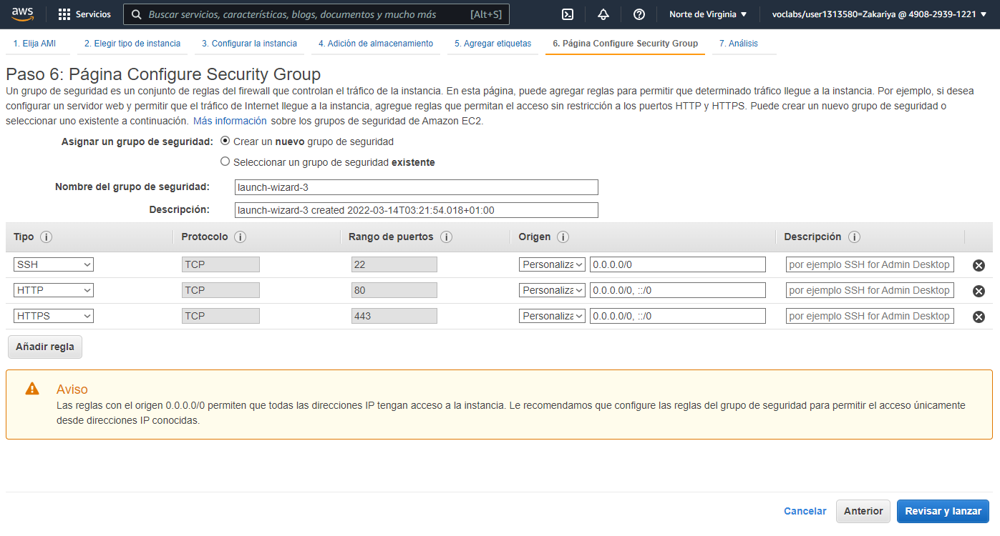
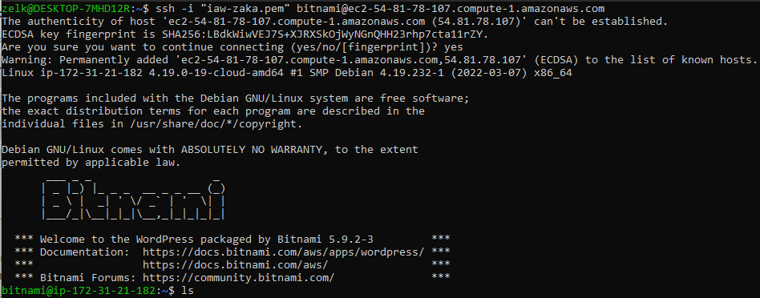
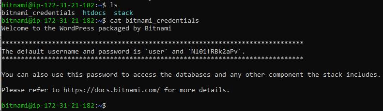
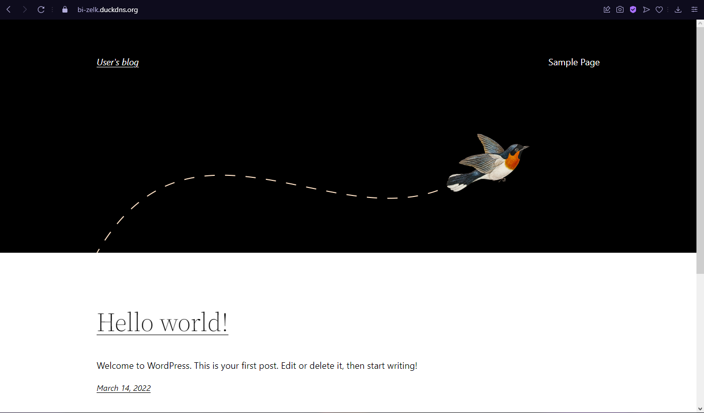
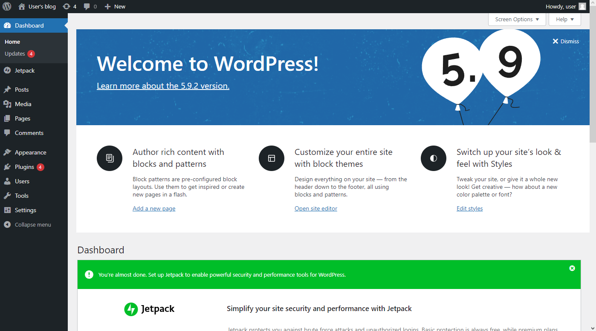
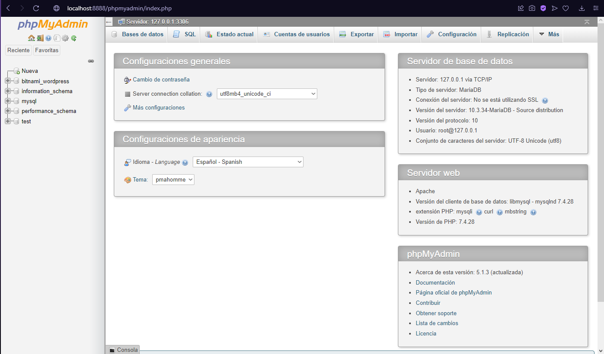

# Práctica 12: Amazon Machine Image (AMI) de Bitnami para WordPress

AMI: [ami-04368838d2c170804](https://bitnami.com/redirect/to/1995520/wordpress-5.9.2-3-amidebian-x64-hvm-ebs-nami?region=us-east-1) Es la ultima versión de la Community AMI de Bitnami con la ultima versión de WordPress. Estraida de la [lista de todas las AMIS disponibles](https://bitnami.com/stack/wordpress/cloud/aws/amis) la página oficial de Bitnami.

1. Se crea como una máquina normal de Amazon. Seguimos los pasos y en Grupos de seguridad agregamos los siguientes:

    - SSH (TCP)
    - HTTP (TCP)
    - HTTPS (TCP)

    

2. Para conectar a la instancia debemos tener en cuenta de que el usuario es __'bitnami'__. Por lo que en el ssh hay que poner __'bitnami'__ en vez de __'admin'__, por ejemplo: *`ssh -i "iaw-zaka.pem" bitnami@ec2-54-81-78-107.compute-1.amazonaws.com`*.

    

3. Una vez estamos dentro debemos buscar el fichero de las credenciales y le hacemos un cat. 

    **Nota**: Suele tardar hasta que se verifique la imagen.

    

4. Entramos en el directorio stack/bncert para configurar HTTPS con la utilidad bncert. Ejecutamos en mi caso el bncert-0.7.3-linux-x64.run y seguimos los pasos para configurar nuestro sitio como HTTPS.

    
        bitnami@ip-172-31-21-182:~/stack/bncert$ sudo ./bncert-0.7.3-linux-x64.run
        ----------------------------------------------------------------------------
        Welcome to the Bitnami HTTPS Configuration tool.

        ----------------------------------------------------------------------------
        Domains

        Please provide a valid space-separated list of domains for which you wish to
        configure your web server.

        Domain list []: bi-zelk.duckdns.org

        The following domains were not included: www.bi-zelk.duckdns.org. Do you want to add them? [Y/n]: n

        Warning: No www domains (e.g. www.example.com) or non-www domains (e.g.
        www.example.com) have been provided, so the following redirections will be
        disabled: non-www to www, www to non-www.
        Press [Enter] to continue:
        ----------------------------------------------------------------------------
        Enable/disable redirections

        Please select the redirections you wish to enable or disable on your Bitnami
        installation.

        Enable HTTP to HTTPS redirection [Y/n]: y

        ----------------------------------------------------------------------------
        Changes to perform

        The following changes will be performed to your Bitnami installation:

        1. Stop web server
        2. Configure web server to use a free Let's Encrypt certificate for the domains:
        bi-zelk.duckdns.org
        3. Configure a cron job to automatically renew the certificate each month
        4. Configure web server name to: bi-zelk.duckdns.org
        5. Enable HTTP to HTTPS redirection (example: redirect
        http://bi-zelk.duckdns.org to https://bi-zelk.duckdns.org)
        6. Start web server once all changes have been performed

        Do you agree to these changes? [Y/n]: y

        ----------------------------------------------------------------------------
        Create a free HTTPS certificate with Let's Encrypt

        Please provide a valid e-mail address for which to associate your Let's Encrypt
        certificate.

        Domain list: bi-zelk.duckdns.org

        Server name: bi-zelk.duckdns.org

        E-mail address []: zelk991@g.educaand.es

        The Let's Encrypt Subscriber Agreement can be found at:

        https://letsencrypt.org/documents/LE-SA-v1.2-November-15-2017.pdf

        Do you agree to the Let's Encrypt Subscriber Agreement? [Y/n]: y

        ----------------------------------------------------------------------------
        Performing changes to your installation

        The Bitnami HTTPS Configuration Tool will perform any necessary actions to your
        Bitnami installation. This may take some time, please be patient.

        ----------------------------------------------------------------------------
        Success

        The Bitnami HTTPS Configuration Tool succeeded in modifying your installation.

        The configuration report is shown below.

        Backup files:
        * /opt/bitnami/apache/conf/httpd.conf.back.202203140244
        * /opt/bitnami/apache/conf/bitnami/bitnami.conf.back.202203140244
        * /opt/bitnami/apache/conf/bitnami/bitnami-ssl.conf.back.202203140244
        * /opt/bitnami/apache/conf/vhosts/wordpress-https-vhost.conf.back.202203140244
        * /opt/bitnami/apache/conf/vhosts/wordpress-vhost.conf.back.202203140244

        Find more details in the log file:

        /tmp/bncert-202203140244.log

        If you find any issues, please check Bitnami Support forums at:

        https://community.bitnami.com

        Press [Enter] to continue:

        bitnami@ip-172-31-21-182:~/stack/bncert$
        

5. Accedemos a la URL https://bi-zelk.duckdns.org. Ahora tenemos listo un sitio WordPress listo para administrar.

    

    Probamos entrar a wp-admin con las credenciales obtenidas.
    

6. Ahora creamos un tunel SSH de la máquina bitnami a mi máquina para acceder a phpMyAdmin desde localhost:8888/phpmyadmin de mi máquina. 

    Usando `ssh -N -L 8888:127.0.0.1:80 -i "iaw-zaka.pem" bitnami@ec2-54-81-78-107.compute-1.amazonaws.com` creamos el tunel.

    Ahora desde un navegador ponemos 'http://localhost:8888/phpmyadmin/'.
    